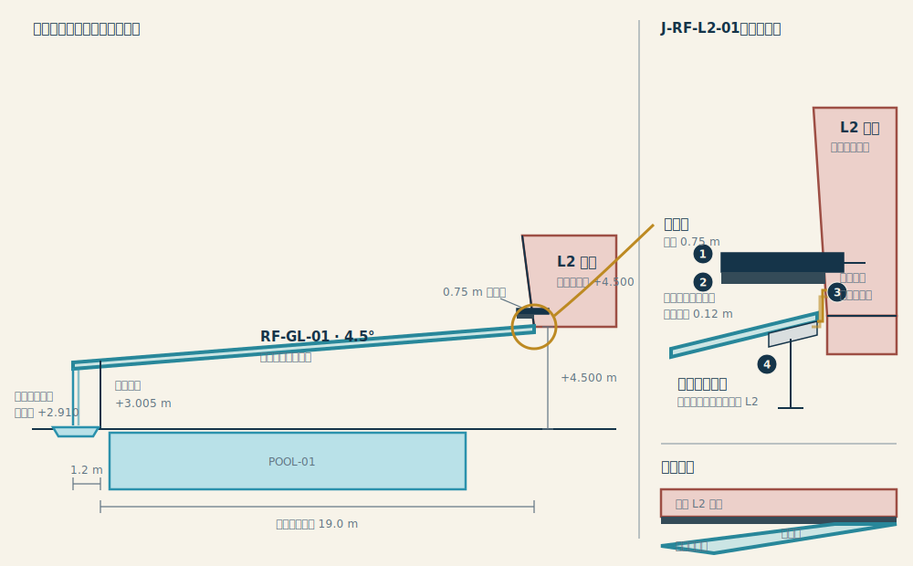

# OPEN-010｜玻璃屋頂、L2 分層交界、雨簾與雨水回用設計

- 日期：2026-07-15
- 類型：design
- 狀態：completed
- 完成日期：2026-07-16
- 任務：`TASK-008`
- 目標版本：0.3.0
- 已核准決策：`DEC-033`、`DEC-034`
- 審閱：使用者於 2026-07-16 指示完成既有 0.3.0 任務並同步 HTML
- 相鄰但不納入：`OPEN-011` 的旋轉支點、鏡牆牆高、材料、眩光與熱效能

## 1. 目的與邊界

本文件曾是 `OPEN-010` 的 active design owner，保存已由使用者核准的玻璃屋頂幾何、L2 高端交界、分層外觀、雨簾及雨水回用設計。0.3.0 完成模型、圖集、文件與驗證同步後，本文件轉為 completed 並封存。

本輪不重做 `TASK-007`。2F 水平 +9.5°、鏡牆外傾 +8.5° 及其日照研究維持既有成果；鏡牆其餘議題仍由 `OPEN-011` 管理。

## 2. 已核准的屋頂幾何

| 項目 | 設計值 | 狀態 |
| --- | ---: | --- |
| `roof.pitch` | 4.5° | confirmed |
| `level.L2`／`roof.highElevation` | +4.500 m | confirmed |
| 室內水平跨度 | 19.0 m | working |
| 低端外挑 | 1.2 m | confirmed |
| 高端至滴水端總水平長度 | 20.2 m | derived |
| 遠端短邊牆處屋頂高度 | 約 +3.005 m | derived |
| 外側雨簾滴水端高度 | 約 +2.910 m | derived |

高端 `J-RF-L2-01` 對齊 L2 地坪附近，而不是 L2 天花板。低端超出泳池遠端短邊玻璃牆，雨天沿全寬形成自然雨簾。

## 3. 已核准的 A＋B 分層交界

真實構造採 A：`RF-GL-01` 由自己的結構支撐，與 L2 保持獨立荷重路徑；交界概念包含止水坎、活動接縫、雙層泛水及可拆卸檢修界面。玻璃屋頂不得承載 L2，L2 也不得作為玻璃屋頂的必要支承。

外觀表現採 B：由 L2 外殼在高端上方形成全寬薄遮簷，遮住主要接縫並建立三層閱讀順序：

1. 上方完整、較厚實的 L2 量體。
2. 中間連續而深色的陰影／維修縫。
3. 下方輕薄、透明且以 4.5° 上升的玻璃屋頂。

| 外觀控制 | 工作值 |
| --- | ---: |
| L2 外殼薄遮簷出挑 | 0.75 m |
| 遮簷視覺厚度 | 0.15 m |
| 連續陰影／維修縫 | 0.12 m |
| 遮簷兩端側向回折 | 0.60 m |

上述是概念外觀控制值，不取代結構、防水、帷幕、玻璃及建築物理專業的最終尺寸。材料尚未核准，不以示意色彩代替材料決策。

## 4. 核准示意圖



本圖左側採水平與垂直同尺度，忠實表達 4.5°；右側節點為非比例放大，只說明荷重分離、遮簷、陰影縫、活動接縫與雙層泛水的層次，不是施工詳圖。

## 5. 建築參考與轉化原則

- [Beyeler Foundation Museum／Renzo Piano Building Workshop](https://www.rpbw.com/project/beyeler-foundation-museum)：取其實體量體與漂浮玻璃屋頂之間的分離感及薄遮簷，不複製造型。
- [Great Court at the British Museum／Foster + Partners](https://www.fosterandpartners.com/projects/great-court-at-the-british-museum/)：取其輕型玻璃屋頂與厚重建築本體各自成立、再以精密節點相遇的結構誠實。
- [New Museum／SANAA 官方導覽](https://assets.ctfassets.net/2a1suvoibba1/1xivDSzDc69F6eNP3yHqfR/858255c41e4fd67862828c686b92788e/2021_Triennial_Guide_v3.pdf)：只取一次精準錯位所形成的陰影、懸挑與層次，不引入多重堆疊。

本案已有 2F 水平 +9.5° 與鏡牆外傾 +8.5° 的方向性，因此新增外觀語彙限制為一條連續遮簷及一條連續陰影縫，避免裝飾性直柵、假梁或多層小雨棚互相競爭。

## 6. 被動雨簾與承接

- 低端設全寬均壓槽、整流擋板與連續銳利滴水唇。小雨以分散滴流呈現，正常降雨形成較連續的自然雨簾；旱天不以循環泵製造水幕。
- 雨簾下方採加蓋、可拆洗且防滑的封閉承接溝，不設孩童可進入的開放水池。承接溝以止水邊與地坪／操場逕流隔離，只收集 `RF-GL-01` 屋頂水。
- 超過均壓槽、承接溝或後端處理能力的極端雨量，經高位溢流口與獨立旁通管排往基地雨排／滲透系統，不強迫穿過雨簾或儲水設備。
- 滴水端維持約 +2.910 m；雨簾落點、承接溝與行人動線之間須以濺水帶及止滑界面分離。最終槽寬、格柵載重、濺水距離與排水量由 `OPEN-014` 計算。

## 7. 雨水處理、儲存與廁所回用

流程固定為：

```text
RF-GL-01 屋頂水
  → 可拆式落葉／雜物濾網
  → 初期雨水分流
  → 沉砂＋可維修過濾
  → 加蓋、通氣防蟲的非飲用水儲水槽
  → 獨立泵送與標示管線
  → L1 廁所沖洗
```

- 系統只收屋頂水，不混入操場、地坪、遊戲區或污水。
- 自來水補水必須以可見空氣間隙或同等認可的防回流隔離，不得與雨水管路直接交叉連通。
- 儲水槽設檢修、排泥、液位控制與高位溢流；低水位或設備故障時由隔離補水維持廁所使用，雨簾仍保持被動並可停止收水。
- 非飲用水管、出水點及設備須一致標示；水質檢測、消毒需求、泵浦備援、儲量與基地排放條件由後續專業設計確認。

## 8. 高端交界的施工邏輯

- 屋頂主結構、L2 量體與外觀薄遮簷維持三條可辨識且互不依賴的荷重路徑。
- 屋頂高端設獨立止水坎、活動縫、內外兩道泛水與可拆檢修蓋；遮簷只遮蔽界面並導離立面雨水。
- 室內側另設連續冷凝水槽及可清通排水路徑；斷熱、防潮、結露量與玻璃邊部溫度仍須建築物理計算。
- 0.75 m 遮簷、0.15 m 視覺厚度、0.12 m 陰影縫與 0.60 m 回折是 0.3.0 的外觀控制值，不是施工下料尺寸。

## 9. 核准邊界

本規格已核准作為 0.3.0 概念模型及 HTML 圖集的實作依據。`OPEN-010` 可在模型、圖集、文件與驗證同步後關閉；材料厚度、固定件、排水設計雨量、承接溝尺寸、儲槽容積、泵浦揚程、水質處理與冷凝／熱工計算轉由 `OPEN-014` 管理，不得在概念圖上虛構施工定案。
