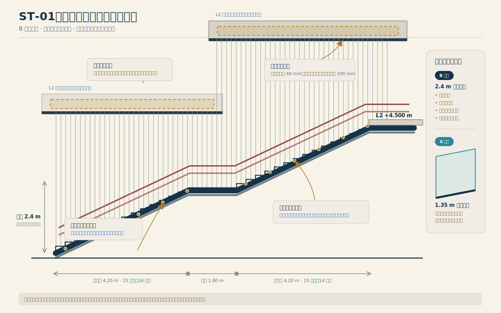

# ST-01 樓梯定案設計

- 日期：2026-07-16
- 類型：design
- 狀態：completed
- 完成日期：2026-07-16
- 任務：`TASK-009`
- 目標版本：0.3.0
- 審閱：使用者已於 2026-07-16 核准完整書面規格與示意圖
- 依據：`DEC-017`～`DEC-019`、`DEC-035`
- 限制：設計書面核准並另立實作計畫前，不修改模型、圖集、Viewer 或版本

## 1. 目的與範圍

本文件專門收斂 0.3.0 的 `ST-01` 樓梯設計。它不重做 `TASK-007`，也不把樓梯議題混入 `OPEN-010` 的屋頂／雨水設計。當樓梯規格經使用者完整審閱核准後，才同步至 `03`～`05` owner、建立實作計畫並修改單一參數模型。

## 2. 已核准幾何

| 項目 | 設計值 | 狀態 |
| --- | ---: | --- |
| L1 至 L2 總升高 | 4.500 m | confirmed |
| 淨寬 | 1.800 m | confirmed |
| 級高數 | 30；兩跑各 15 | confirmed |
| 單級級高 | 0.150 m | derived |
| 每跑踏面數 | 14 | derived |
| 踏面深度 | 0.300 m | confirmed |
| 每跑水平長度 | 4.200 m | derived |
| 中間平台長度 | 1.800 m | confirmed |
| 總平面長度 | 10.200 m | derived |
| 梯段坡度 | 約 26.6° | derived |
| 中間平台標高 | +2.250 m | derived |
| 上端位置 | E 軸 X=27.000 m | working |
| 下端位置 | X=16.800 m | derived；仍須與到達動線及建築界面驗證 |

級高數與踏面數必須分開保存：每跑 15 個級高只形成 14 個水平踏面，模型不得再以 `risersPerRun × treadDepth` 誤算梯段長度。

## 3. 結構與形體

- 採 S1：雙側連續封閉箱型鋼梯梁，貫穿兩跑與中間平台。
- 主要垂直支承位於 L1 與 L2；平台下不設柱，平台以箱型構造整合於雙梯梁之間。
- 樓梯不由玻璃屋頂承重，也不得把弦幕張力傳給玻璃屋頂或玻璃帷幕。
- 踢面封閉、梯下空間完全開放；兩者不得混淆。
- 清水模建築中的正式美學為「深色懸浮切線」：石墨深灰消光梯梁、淺暖灰止滑踏面、後退式封閉踢面與低眩光線性照明。

## 4. 防墜界面

### 4.1 B 主案：全高垂直弦幕

- 防護高度以梯鼻線／平台完成面以上 2.4 m 為最低目標；鋼線實際延伸至隱藏集力構件。
- 僅使用垂直平行細線，概念間距約 40 mm；最終判定必須計入孩童推擠後的撓度，使有效開口仍小於 100 mm。
- 成人與兒童扶手獨立固定於梯梁，不以細線承受扶手水平推力。
- 上、下張力與固定件均須可檢查、可逐條調整與更換，不得形成箱型梯梁內的積水路徑。
- 主細節採隱藏式集力梁：上端優先藏入 L2 樓板邊梁、樓梯開口上方結構帶或獨立乾式梯廊橫框的陰影縫，不新增一條與樓梯平行的完整外露上框梁。
- 隱藏集力梁只可由 L2／梯廊獨立結構承擔；若剖面、淨高或維修開口無法成立，才使用局部外露自承框，或直接回退 A 案。

### 4.2 A 備案：高夾層玻璃欄板

- 高度 1.35 m，採具破裂後殘餘承載能力的夾層安全玻璃；厚度、夾層與底槽由結構計算決定。
- 當 B 案的含氯材料、張力／撓度、隱藏節點、維修性或實尺寸樣段任一關鍵驗證未通過時，A 案成為自動退場方案。
- A 案仍使用獨立雙高度扶手、無可攀爬水平構件、封閉梯級側邊三角缺口及透明面視覺辨識標記。

## 5. 踏面、排水與照明方向

- 淺暖灰、低吸水率、濕腳條件可驗證的全瓷止滑踏面。
- 每階前緣以整合式對比止滑帶辨識梯鼻，不使用容易鬆脫的外加厚梯鼻。
- 踏面微幅導水至可拆洗側槽；排水不得進入箱型梯梁、張力錨具或玻璃底槽。
- 雙高度扶手下方使用連續低眩光線燈均勻照亮踏面，不以高亮度點光源逐階炫示。
- 材料顏色、觸感、濕腳止滑、清潔劑與含氯環境耐受性須以實體樣品確認。

## 6. 實作前必要驗證

1. 以單一模型重新推導樓梯 bounds，驗證 X=16.800～27.000 m 不阻斷 `RTE-L1-ARRIVAL-01`、三個戶外開口、廁所前後門與乾式通道。
2. 以等比例縱剖面驗證兩跑、平台、L2 樓板開口、2.4 m 防護高度、頭部淨高及隱藏集力梁位置。
3. 結構技師驗證 S1 梯梁、平台扭轉、振動／撓度、L1／L2 端部節點及弦幕集力構件。
4. 材料專業驗證室內泳池含氯濕氣下的細線、端頭、張力器與緊固件；不得預設一般 304／316 不鏽鋼即可使用。
5. 製作 B 案實尺寸樣段，測試孩童推擠、有效開口、鬆弛、碰撞、夾手、視覺辨識、調整與逐條更換。
6. 由建築師／相關專業確認最終用途分類、樓梯、欄杆、扶手、避難、無障礙與公共安全要求。本專案文件只作概念設計，不代替簽證。

## 7. 書面審閱門檻

本文件已完成使用者書面審閱。它確認 30 級高／28 踏面、S1 雙箱型梯梁、封閉踢面但梯下開放、清水模中的深色懸浮切線、B 弦幕主案、A 玻璃備案，以及隱藏集力梁優先於外露平行上框梁。模型實作仍須由 `TASK-010` 的 implementation plan 管理，且不得把 `OPEN-013` 的專業驗證誤標為完成。
